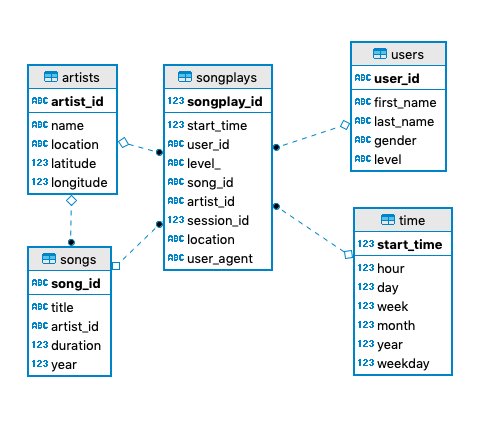

# Data Lake Project Using Spark

This repository contains the solution to the Data Lake Project of the 
Udacity's Data Engineering Nanodegree.   

The project moves the data from `json` files to `parquet` files. The 
representation is changed in order to improve the query performance.
The data transformation process is carried out using `spark`.   

The original data resides in S3, in a directory containing all user 
activity on the app, as well as a directory containing the metadata
of their songs.   

The `data` folder of this project contains a sample of the
files stored in S3.   

The ETL process starts by reading the JSON files of the song metadata 
folder. It then reads all the information related to the songs and writes 
them to `parquet` files partitioned by year and artist. From the same 
song metadata, the ETL also creates a `parquet` table for the artist 
information.   

The second step of the ETL process is reading the JSON files of the 
user activity on the app. Here the input data is used to create `parquet` 
tables for users, time and songplay.   

Interesting points in the ETL process: 

- For the users table, a window function is used to select the most recent 
record of subscription level.  
- For the time table, a user defined function is used to conver the UNIX epoch 
record to a datetime. 

## Dimensional Model

The output dimensional model is:




## Files in the project

- `dl.cfg`: Example configuration file.
- `etl.py`: ETL pipeline process using PySpark SQL.

## Running the project

Execute the `etl.py` file.   

```bash
python etl.py
```

## Example Queries

```python
sparkify_data = 's3://path/to/your/output/directory/bucket'


def users_by_gender_level(spark):
    df = spark.read.parquet(sparkify_data + 'users/')
    df.createOrReplaceTempView('users')
    result = spark.sql('''
        select u.gender, u.level, count(1)
        from users u
        group by u.gender, u.level 
    ''')
    result.show()


def reproductions_by_weekday(spark):
    time_df = spark.read.parquet(sparkify_data + "time/")
    time_df.createOrReplaceTempView("time")
    songplay_df = spark.read.parquet(sparkify_data + 'songplays/')
    songplay_df.createOrReplaceTempView('songplays')
    result = spark.sql('''
        select t.weekday, count(1)
        from time t join songplays s on (t.start_time = s.start_time)
        group by t.weekday
    ''')
    result.show()
    

def activity_by_hour(spark):
    time_df = spark.read.parquet(sparkify_data + "time/")
    time_df.createOrReplaceTempView("time")
    songplay_df = spark.read.parquet(sparkify_data + 'songplays/')
    songplay_df.createOrReplaceTempView('songplays')
    result = spark.sql('''
        select t.hour, count(1)
        from songplays s join time t on (s.start_time = t.start_time) 
        group by t.hour
    ''')
    result.show()
```

